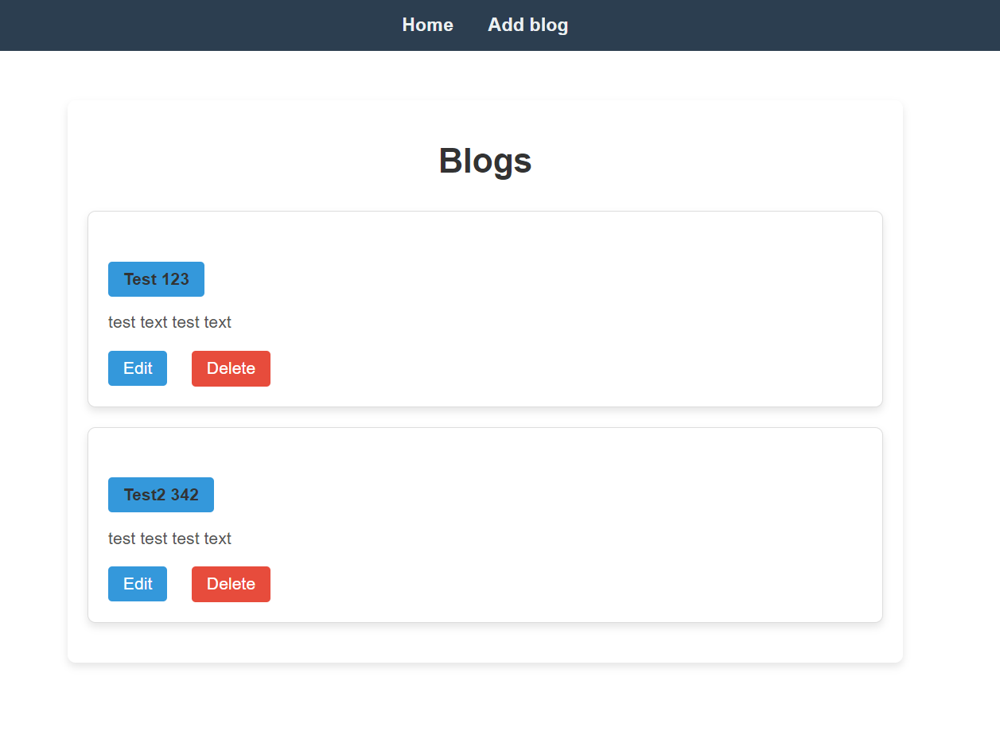
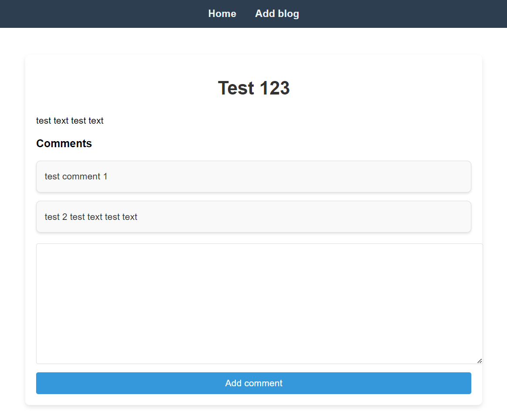
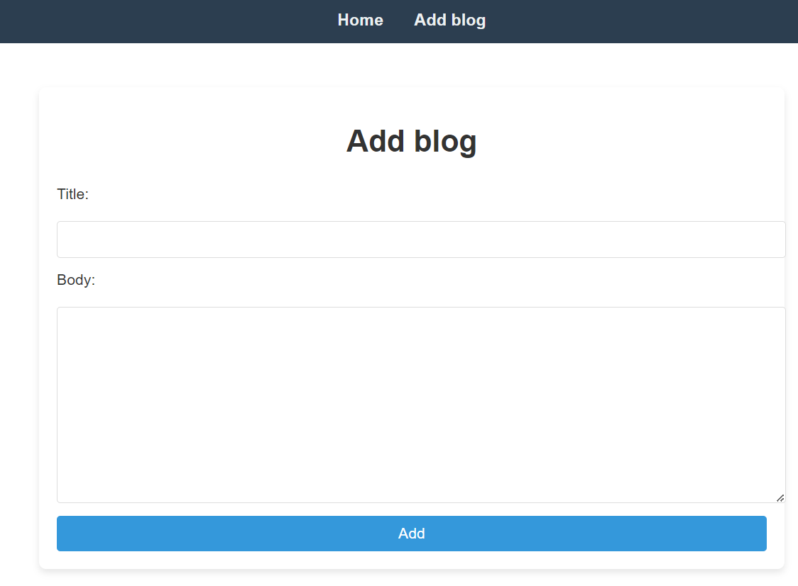
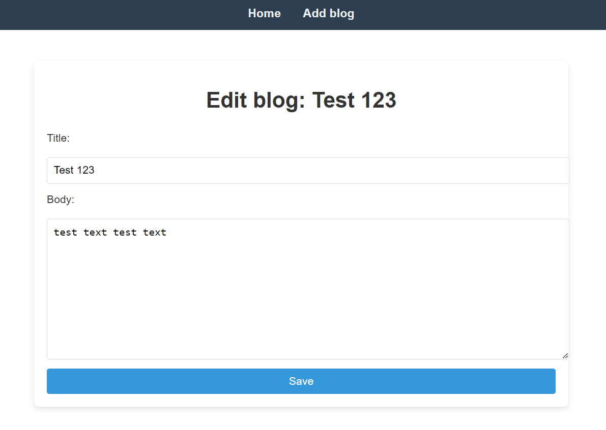
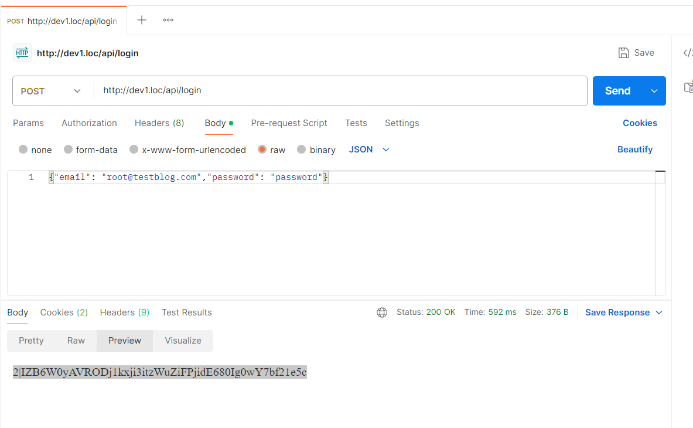
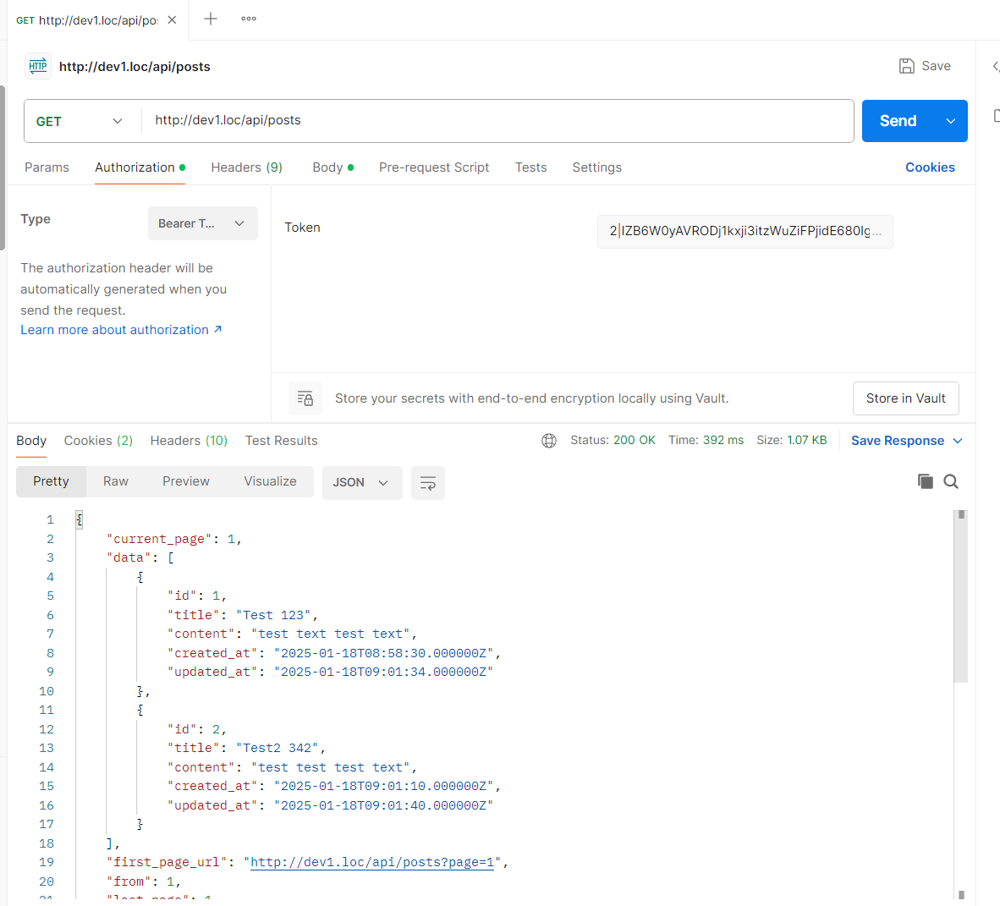

# Laravel Blog Project

This is a simple blog management system built with Laravel. It includes functionality for creating, editing, viewing, and deleting blog posts, as well as adding comments and searching for posts.

## 📦 Requirements
- PHP 7.4 - 8.0
- Composer
- Laravel 9+
- MySQL / MariaDB

## 📚 Features
- **CRUD for Blog Posts**: Create, update, delete, and view blog posts.
- **Comments**: Add comments to posts.
- **Search**: Search posts by title.
- **API Support**: Endpoints for managing posts and comments.
- **Sanctum Authentication**: API token-based authentication.

---

## 🚀 Project Setup

1. **Clone the repository:**
   ```bash
   git clone https://github.com/I3rixon/blog-test-laravel.git
   cd blog
   ```

2. **Install dependencies:**
   ```bash
   composer install
   ```

3. **Create the `.env` file and set the database connection:**
   ```bash
   cp .env.example .env
   ```
   Update the following in `.env`:
   ```plaintext
   DB_CONNECTION=mysql
   DB_HOST=127.0.0.1
   DB_PORT=3306
   DB_DATABASE=blog
   DB_USERNAME=root
   DB_PASSWORD=
   ```

4. **Run migrations:**
   ```bash
   php artisan migrate
   ```

5. **Generate the application key:**
   ```bash
   php artisan key:generate
   ```

6. **Run the development server:**
   ```bash
   php artisan serve
   ```

---

## 🛠️ Models & Migrations

- **Post:**
  - `title`: string
  - `content`: text
  - `timestamps`

- **Comment:**
  - `content`: text
  - `post_id`: foreign key

Run migrations with:
```bash
php artisan migrate
```

---

## 🎛️ Controllers

- **PostController:**
  - `index`: View all posts
  - `show`: View a single post
  - `create`: Show the create post form
  - `store`: Save a new post
  - `edit`: Edit a post
  - `update`: Update a post
  - `destroy`: Delete a post

- **CommentController:**
  - `store`: Add a comment to a post

---

## 🌐 Routes

```php
Route::resource('posts', PostController::class);
Route::post('posts/{post}/comments', [CommentController::class, 'store'])->name('comments.store');
```

---

## 🔐 Sanctum API Authentication

1. **Install Sanctum:**
   ```bash
   composer require laravel/sanctum
   ```
2. **Run migrations:**
   ```bash
   php artisan migrate
   ```
3. **API Endpoints:**
   - `POST /api/login`
   - `GET /api/posts`
   - `GET /api/posts/{id}`
   - `POST /api/posts/{id}/comments`
4. **Seed the database with a user:**
    ```bash
    php artisan db:seed --class=UserSeeder
    ```
    This seeder will create a user with the following credentials:

    Name: root

    Email: root@testblog.com

    Password: password
---


## ✅ License
This project is open-source and available under the MIT License.

## Screenshots

Here are some screenshots of the project:






**API request via Postman example**


